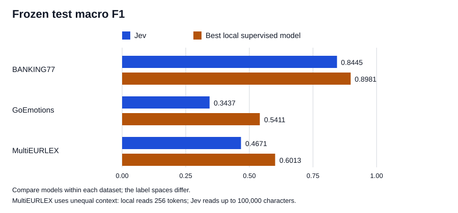

# ModernBERT and Jev: three classification benchmarks

This repository compares local ModernBERT classifiers with TypeSafe Jev on
banking intents, Reddit emotion labels, and EU legal topics. Each task uses
the same prepared records and evaluator for its local and hosted predictions.
The comparison is about existing classification options, not building a
replacement for Jev.

## Results

All scores below are from frozen, complete test runs. Macro F1 is meaningful
within a dataset, not across the three different label spaces.



| Dataset (test size) | Local reference | Jev | Best local supervised model |
| --- | ---: | ---: | ---: |
| BANKING77 (3,080) | Frozen embeddings + logistic regression **0.8816**; zero-shot NLI **0.6207** | Choice **0.8445** | Fine-tuned sentence-transformer + prototypes **0.8981** |
| GoEmotions (5,427) | Frozen embeddings + one-vs-rest logistic regression **0.3335** | Noul **0.3437** | Fine-tuned sigmoid/BCE **0.5411** |
| English MultiEURLEX level 1 (5,000) | — | Noul **0.4671** | Fine-tuned leading-256 sigmoid/BCE **0.6013** |

These are **test macro F1** values. Jev narrowly beat the frozen linear
GoEmotions baseline on that metric, but the fine-tuned model led on all three
tasks. On GoEmotions, fine-tuned BCE also led on micro F1 (0.5929 versus
0.3923 for Jev) and exact-label-set match (0.4712 versus 0.2668).

The long-document comparison is not equal-context. The local MultiEURLEX model
reads only the leading 256 tokenizer tokens; 4,971 of 5,000 test documents
have unselected chunks. Jev reads the full document up to 100,000 Unicode
characters, then equal head and tail portions with an explicit middle-omission
marker. Despite seeing more source text, Jev scored 0.5130 micro F1 and
0.0006 exact match, compared with 0.7417 and 0.1284 for the local model.
Jev predicted 6.71 labels per document against 3.59 gold labels and 3.67
local predictions. It beat the local model on seven of 21 per-label F1
comparisons, including employment and environment, but overprediction
dominated the overall result. The systems' different training and context
policies prevent attributing those label-level wins to Jev alone.

Jev received little task-specific prompt optimization. On BANKING77, adding
one deterministic **training-only** example to each label criterion raised
full-validation macro F1 from 0.7817 to 0.8458; that variant was frozen before
test. GoEmotions and MultiEURLEX used committed criteria and fixed question
templates without a rubric/example search. Their global thresholds, 0.87 and
0.27, came from cached validation probabilities. The MultiEURLEX head-tail
policy addressed an API limit encountered during validation, not a
test-informed attempt to improve accuracy. Jev was not fine-tuned or distilled
into a local model.

## Data and evaluation

| Dataset | Train / validation / test | Task and source |
| --- | ---: | --- |
| BANKING77 | 8,998 / 1,005 / 3,080 | 77 single-label customer-service intents; deterministic validation split from the published training partition. |
| GoEmotions simplified | 43,410 / 5,426 / 5,427 | 27 independent emotion labels and a derived `neutral` fallback; published partitions. |
| English MultiEURLEX level 1 | 11,000 / 1,000 / 5,000 | 21 coarse EUROVOC concepts; English documents from the published chronological partitions. |

The dataset manifests in `configs/datasets/` pin source revisions and
integrity checks. `prepare-*` writes Parquet records under Git-ignored
`data/`. Predictions, model weights, and checkpoints remain under
Git-ignored `runs/`. Only training and validation data informed model,
criterion, context, and threshold selection; the selected configurations
were evaluated once on each official test partition.

Local training and inference used PyTorch on Apple Silicon MPS, with Polars
for data work and Go for the common schema, metrics, and Jev API runner.
Local models use the pinned Apache-2.0
[`answerdotai/ModernBERT-base`](https://huggingface.co/answerdotai/ModernBERT-base)
checkpoint; the zero-shot BANKING77 reference uses the Apache-2.0
[`tasksource/ModernBERT-base-nli`](https://huggingface.co/tasksource/ModernBERT-base-nli)
checkpoint. No local model uses Jev responses as training targets.

- **BANKING77:** frozen embeddings plus logistic regression (`C=100`),
  zero-shot NLI, and a two-epoch sentence-transformer trained with
  same-label positive pairs and train-derived label prototypes. The
  sentence-transformer training run took 20.8 minutes on MPS.
- **GoEmotions:** frozen embeddings plus 27 logistic heads, and a two-epoch
  ModernBERT BCE head with inverse-square-root positive weighting.
  `neutral` is emitted only if no emotion reaches threshold. The BCE
  fine-tune took 84.1 minutes on MPS.
- **MultiEURLEX:** one-epoch ModernBERT BCE with masked mean pooling and
  inverse-square-root positive weighting. A uniformly sampled eight-window
  candidate scored 0.6231 validation macro F1, below leading-256's
  0.6418; leading-256 was selected before test. Jev asked 21 independent
  Noul questions over the configured `document` state.

Metrics are calculated from prediction artifacts, not self-reported by the
runners. Multi-label evaluation includes exact match, micro/macro F1,
per-label scores, and pooled binary calibration over modeled labels.
For example, MultiEURLEX test ECE was 0.03302 for local BCE and 0.12940
for Jev. GoEmotions emotion-level ECE was 0.0324 for fine-tuned BCE and
0.1617 for Jev. These probabilities and Choice confidence have different
semantics; a threshold selected for one model or task does not transfer
automatically to another.

Local per-record prediction work and remote request latency are different
measurements. On MultiEURLEX, local leading-256 recorded 6 / 7 ms p50/p95
prediction work and 126.8 seconds end-to-end for the 5,000-record test.
Jev recorded 125 / 214 ms p50/p95 request latency and 20,661,588 input
tokens. Those numbers do not equate local model loading/training with hosted
service operation.

## Reproduce the method

The repo contains source, pinned configurations, split rules, and analysis
scripts, **not** the downloaded corpus, trained weights, Jev responses, or
frozen prediction artifacts. A fresh checkout can prepare the same datasets
and train new local models, but cannot replay the reported frozen test
predictions without those ignored artifacts. New Jev inference requires
TypeSafe access; it is a new run, not a replay of these results. In particular,
do not tune against an already examined test split and report it as a fresh
holdout.

```sh
uv sync
go run ./cmd/benchmark prepare-banking77
go run ./cmd/benchmark prepare-goemotions
go run ./cmd/benchmark prepare-multieurlex

uv run python python/sentence_transformer_baseline.py \
  --model-output runs/reproduction/banking77.model \
  --output runs/reproduction/banking77.validation.parquet --dry-run
uv run python python/goemotions_bce_baseline.py \
  --model-output runs/reproduction/goemotions.model \
  --output runs/reproduction/goemotions.validation.parquet --dry-run
uv run python python/multieurlex_bce_baseline.py \
  --context-variant leading-256 \
  --model-output runs/reproduction/multieurlex.model \
  --output runs/reproduction/multieurlex.validation.parquet --dry-run
```

`prepare-multieurlex` verifies and caches a roughly 787 MB source archive
under `data/`. Remove `--dry-run` to train **new validation** models under
`runs/reproduction/`; the pinned hyperparameters are in `configs/models/`,
and each run selects its threshold from validation. The original trained
weights are not published. The alternate frozen
embedding, NLI, and one-vs-rest baselines have separate scripts in `python/`.
The common Go evaluator accepts prediction Parquet files:

```sh
go run ./cmd/benchmark metrics-multilabel \
  --dataset data/multieurlex/records.parquet \
  --predictions runs/jev-multieurlex/test-head-tail-100k.predictions.parquet \
  --split test
```

That metrics command needs the **existing local** frozen prediction file.
`python/multieurlex_jev_analysis.py` replays validation threshold selection
from an existing ignored checkpoint without an API call; it does not
regenerate the checkpoint. The Go Jev runners require your account's current
input-token rate via `--input-price-per-million` to enforce a local spending
ceiling. The rate and measured dollar costs are not published here. New
checkpoints bind each prediction to its request configuration and source
record; complete historical checkpoints without fingerprints require
`--allow-legacy-checkpoint-replay` and independent provenance verification.
The legacy option cannot add requests or resume a partial checkpoint.

## Rights and scope

Original code, configurations, and documentation here are
[Apache-2.0](LICENSE). The vendored TypeSafe skill retains its
[MIT license](.agents/skills/typesafe-ai/LICENSE). Dataset and model licenses
are separate: [BANKING77](https://huggingface.co/datasets/PolyAI/banking77)
is CC BY 4.0, [GoEmotions](https://huggingface.co/datasets/google-research-datasets/go_emotions)
is Apache-2.0, and the pinned
[MultiEURLEX card](https://huggingface.co/datasets/nlpaueb/multi_eurlex/tree/e18c6f4fc7555e7e2294070c77f9ff23215436a9)
conflicts with itself: its metadata says CC BY-SA 4.0 while its licensing
text says CC BY 4.0 for the underlying EU material. The
[manifest](configs/datasets/multieurlex-english-level1.json) preserves both
statements, the Xenouleas et al. (2022) release citation, and the original
Chalkidis et al. (2021) paper. This repository distributes aggregate results,
not the corpus or trained weights; its Apache license does not override
upstream rights.

GoEmotions labels describe annotations of Reddit comments, not people's
internal states. The legal-domain results do not establish fitness for
high-stakes legal use. The comparison measures these specific data splits,
model versions, state policies, and validation-selected settings.
